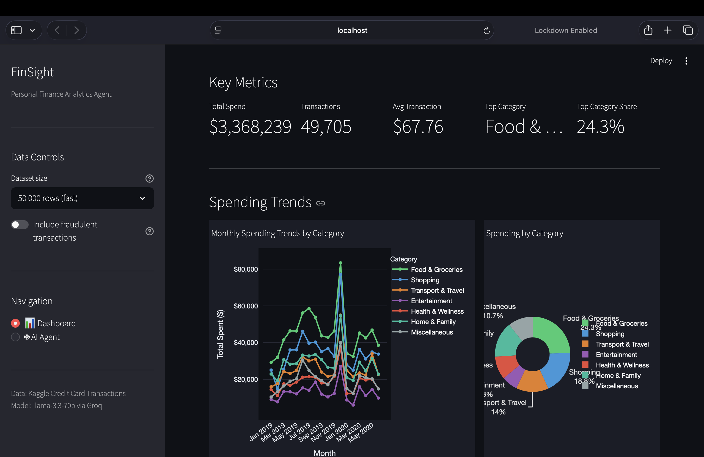
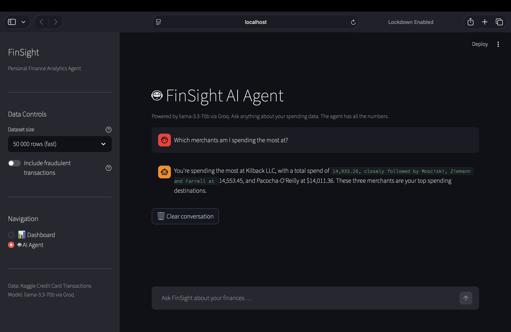

# 💰 FinSight: Personal Finance Analytics Agent

> An end-to-end data analytics application that loads real bank transaction data, cleans and categorizes spending, renders interactive visualizations, and powers a conversational AI agent that answers natural-language questions about your finances. Like having a personal financial advisor in your browser.


---

## 📸 Screenshots

### Dashboard: KPI Tiles & Spending Trends


### AI Agent: Conversational Interface


---

## ✨ Features

| Feature | Detail |
|---|---|
| **Data Pipeline** | Loads 1.3M+ credit card transactions, cleans nulls, parses dates, strips artifacts |
| **Smart Categorization** | Maps 14 raw bank categories to 7 clean spending categories |
| **Interactive Dashboard** | 5 Plotly charts: monthly trends, stacked spend composition, donut chart, top merchants, hour x day heatmap |
| **Date Range Filter** | Slice the entire dashboard by any month range via sidebar |
| **Conversational AI Agent** | LangChain + Groq (llama-3.3-70b) answers questions about your data |
| **Fraud Awareness** | Toggle to include/exclude flagged fraudulent transactions |
| **Fully Modular** | Each file is an independent, importable, testable module |

---

## 🗂️ Project Structure

```
finsight/
├── data/
│   └── credit_card_transactions.csv   # Kaggle dataset (not committed)
├── venv/                              # Python virtual environment
├── .env                               # API keys (never commit this)
├── data_loader.py                     # CSV loading, cleaning, date parsing
├── categorizer.py                     # Raw category to FinSight category mapping
├── visualizations.py                  # 4 interactive Plotly charts
├── agent.py                           # LangChain + Groq conversational agent
├── app.py                             # Streamlit UI, ties everything together
├── requirements.txt                   # Pinned dependencies
└── README.md
```

---

## 🧱 Architecture

```
CSV File
   │
   ▼
data_loader.py      <- clean, parse, enrich (dates, column names)
   │
   ▼
categorizer.py      <- map raw categories to 7 FinSight categories
   │
   ├──► visualizations.py  <- 4 Plotly charts (trend, pie, bar, heatmap)
   │
   └──► agent.py           <- build_context_summary() -> ChatGroq chain
              │
              ▼
           app.py          <- Streamlit: Dashboard page + AI Agent page
```

---

## ⚙️ Setup

### 1. Clone the repository
```bash
git clone https://github.com/YOUR_USERNAME/finsight.git
cd finsight
```

### 2. Create and activate a virtual environment
```bash
python3.11 -m venv venv
source venv/bin/activate        # macOS / Linux
venv\Scripts\activate           # Windows
```

### 3. Install dependencies
```bash
pip install -r requirements.txt
```

### 4. Add your Groq API key
Create a `.env` file in the project root:
```
GROQ_API_KEY=your_groq_api_key_here
```
Get a free API key at [console.groq.com](https://console.groq.com).

### 5. Add the dataset
Download the **Credit Card Transactions** dataset from Kaggle and place it at:
```
data/credit_card_transactions.csv
```

---

## 🚀 Running the App

```bash
streamlit run app.py
```

Then open [http://localhost:8501](http://localhost:8501) in your browser.

---

## 🧪 Testing Each Module Independently

Each module has a built-in self-test. Run it directly to verify it works:

```bash
# 1. Verify data loading and cleaning
python data_loader.py

# 2. Verify category mapping and summary
python categorizer.py

# 3. Verify all 4 Plotly charts build (opens browser)
python visualizations.py

# 4. Verify the AI agent with a 3-turn conversation
python agent.py
```

---

## 📊 Dataset

- **Source**: [Kaggle - Credit Card Transactions Dataset (Priyam Choksi)](https://www.kaggle.com/datasets/priyamchoksi/credit-card-transactions-dataset)
- **Size**: 1,296,675 rows x 24 columns
- **Period**: January 2019 to June 2020
- **Note**: Merchant names in the raw data are prefixed with `fraud_` as a dataset artifact. FinSight strips this automatically.

---

## 🤖 AI Agent

The FinSight agent uses a **context-injection** architecture:

1. `build_context_summary()` computes a structured text snapshot of the data (totals, per-category breakdown, top merchants, behavioral patterns).
2. This snapshot is baked into the **system prompt** so the model answers from facts, not guesses.
3. A rolling **conversation window** (10 turns) lets the agent handle follow-up questions naturally.

**Model**: `llama-3.3-70b-versatile` via Groq (free tier, ~300 tokens/sec)

Example questions the agent answers well:
- *"What is my biggest spending category and what percentage of my budget does it take?"*
- *"Which merchants am I spending the most at?"*
- *"How did my spending change between January and March 2020?"*
- *"When during the week do I tend to spend the most?"*

---

## 🛠️ Tech Stack

| Layer | Technology |
|---|---|
| Language | Python 3.11 |
| Data | Pandas 2.3 |
| Visualizations | Plotly 6.5 |
| UI | Streamlit 1.54 |
| AI Orchestration | LangChain 1.2 (LCEL) |
| LLM Inference | Groq (llama-3.3-70b-versatile) |
| Config | python-dotenv |


